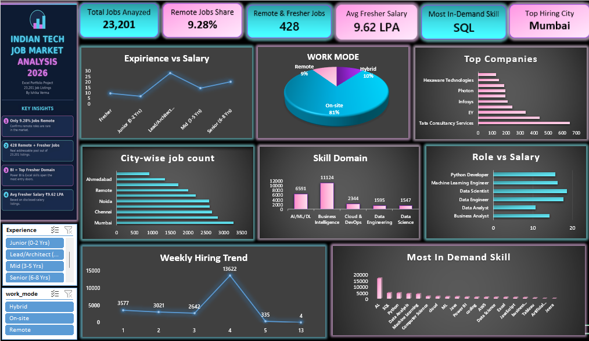

# 📊 Indian Tech Job Market Analysis 2026 — Excel Dashboard

An interactive Excel dashboard analyzing **23,201 tech job listings** across India to uncover real hiring trends — remote work availability, salary benchmarks by role and experience, in-demand skills, and top hiring companies/cities.

---

## 🔑 Key Insights

| Metric | Value |
|---|---|
| Total Jobs Analyzed | 23,201 |
| Remote Job Share | 9.28% |
| Remote + Fresher-Friendly Jobs | 428 |
| Avg Fresher Salary (disclosed) | ₹9.62 LPA |
| Top Hiring City | Mumbai |
| Most In-Demand Skill | SQL |
| Top Fresher-Friendly Domain | Business Intelligence |

- **Remote roles are rare** — only 9.28% of all listings are remote, reinforcing the need for a highly selective, targeted job search.
- **Business Intelligence leads fresher hiring** — 2,371 fresher-friendly jobs fall under BI, more than double the next closest domain (AI/ML/DL).
- **SQL edges out Python** as the most frequently required skill (4,410 vs 4,351 mentions).
- **Salary nearly triples** from Fresher (~₹9.6 LPA) to Lead/Architect level (~₹28.1 LPA).
- **IT services giants dominate hiring** — TCS, Accenture, and EY top the list of hiring companies.

---

## 🛠️ Features & Techniques Used

- **Data Cleaning** — structured tables, type validation, duplicate checks
- **7 Pivot Tables** — salary by role, work mode distribution, city-wise hiring, experience vs salary, skill domain breakdown, top hiring companies, weekly hiring trend
- **Formulas** — `XLOOKUP`, `AVERAGEIFS`, `COUNTIFS`, wildcard `COUNTIF`
- **Interactive Dropdowns** — Data Validation for company rating lookup and skill search
- **Cross-Filtering Slicers** — connected across multiple pivot tables (Work Mode, Experience Tier)
- **KPI Dashboard** — 6 key metric cards + 7 charts (Bar, Column, Line, Pie) in one interactive view

---

## 📁 Repository Contents

| File | Description |
|---|---|
| `Indian_Tech_Jobs_2026_Dashboard.xlsx` | Full interactive Excel dashboard (pivots, formulas, slicers, charts) |
| `Indian_Tech_Job_Market_Analysis_2026.pptx` | Slide-by-slide presentation of insights (chart + explanation per slide) |
| `screenshots/` | Dashboard and individual chart screenshots |
| `dataset/indian_tech_jobs_2026.csv` | Source dataset (23,201 job listings) |

---

## 📈 Chart Gallery

| Salary by Role | Work Mode Distribution |
|---|---|
|  |  |

| Top Hiring Companies | City-wise Job Count |
|---|---|
|  |  |

| Fresher-Friendly Skill Domains | Career Growth Curve (Experience vs Salary) |
|---|---|
|  |  |

| Weekly Hiring Trend | Most In-Demand Skills |
|---|---|
|  |  |

---

## 🧰 Tools

`Microsoft Excel` · `Pivot Tables` · `Data Validation` · `Slicers` · `XLOOKUP` · `AVERAGEIFS` · `COUNTIFS`

---

## 👩‍💻 Author

**Ishika Verma**
Data Analyst | Excel · SQL · Power BI · Python
[LinkedIn](#) · [GitHub](#)

